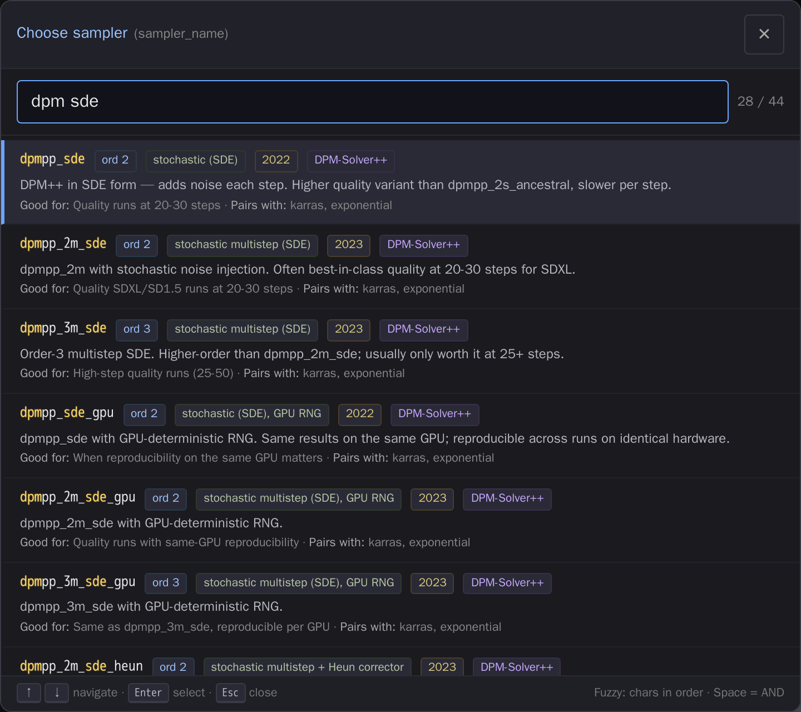
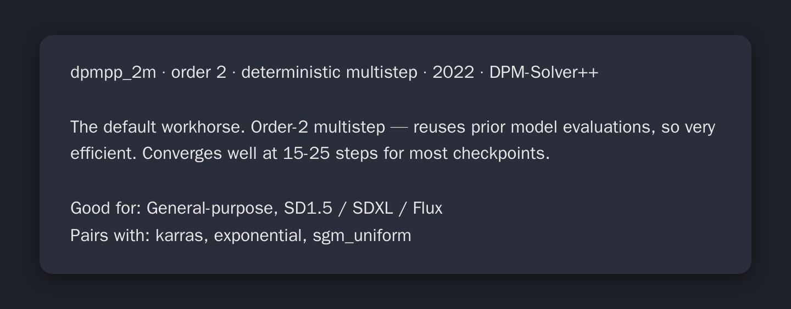

# comfyui-sampler-info

Rich metadata + fuzzy-search picker for ComfyUI's `sampler_name` / `sampler`
/ `scheduler` widgets. Replaces the cryptic alphabetical dropdown with a
modal you can actually navigate — *and* tells you what each sampler is for.

> The stock dropdown is 155 strings in a flat list (with RES4LYF loaded).
> No descriptions, no dates, no hint of when to use what.
> This pack fixes that.

<!-- TODO: drop a screencap of the picker (sampler dropdown opened, "dpm sde"
typed, rows filtered + sorted, matched chars highlighted) at /docs/picker.png
and a tooltip-on-hover shot at /docs/tooltip.png, then wire them up:



-->

## What it does

Two additive enhancements:

**1. Hover/long-press tooltips.** Every `sampler_name` / `sampler` /
`scheduler` combo widget gets a tooltip describing the *currently selected*
value — paper year, family, ODE order, type (deterministic / ancestral /
SDE), one-sentence summary, "good for" use case, schedulers it pairs with,
and "largely superseded by" notes where applicable.

If [comfyui-touch-tooltips](https://github.com/laurigates/comfyui-touch-tooltips)
is also installed, the same tooltips surface on long-press for mobile.

**2. Fuzzy-search modal picker.** Clicking the widget opens a centered
modal dialog instead of the native LiteGraph dropdown:

- Every option as a row with name + colored badges (order, type, year,
  family) + summary + "good for" + "pairs with"
- **fzf-style fuzzy search** at the top: subsequence matching with
  word-boundary bonuses (the underscore-separated naming convention used
  by ComfyUI samplers gets special treatment), space-separated AND tokens
  (`dpm sde` → all SDE-flavored DPM variants), matched chars highlighted
- Keyboard nav: <kbd>↑</kbd> <kbd>↓</kbd> navigate, <kbd>Enter</kbd>
  select, <kbd>Esc</kbd> close, <kbd>PgUp</kbd>/<kbd>PgDn</kbd> jump 8,
  type from anywhere to filter
- Mobile-friendly: 16px input (no iOS auto-zoom), 36px touch targets,
  momentum scrolling. Works much better than the native dropdown which
  tends to misposition on zoomed/panned canvases.
- **Additive**: rows for samplers not in the corpus still render with
  bare names. Wan's wrapper-specific `scheduler` values (`unipc`,
  `dpm++`, `flowmatch_causvid`, …) just show their original tooltip
  without being clobbered.

## Install

### Via ComfyUI Manager *(once accepted into the registry)*

In ComfyUI Manager, search for **"sampler info"** → Install.

### Manual

```sh
cd <ComfyUI>/custom_nodes
git clone https://github.com/laurigates/comfyui-sampler-info
# (no Python deps to install — frontend-only pack)
```

Restart ComfyUI. Hard-refresh your browser tab.

## Usage

Just works. Open any node with a `sampler_name`, `sampler`, or `scheduler`
combo widget (KSampler, KSamplerAdvanced, SamplerCustom, easy kSampler,
WanVideoSampler, HyVideoSampler, LTXVBaseSampler, …) and:

- **Hover** the widget → tooltip describing the currently selected value
- **Click** the widget → fuzzy-search picker modal

Sampler/scheduler widgets are detected by **widget name**, not node type —
so anything that names its widget `sampler_name` / `sampler` / `scheduler`
will get the treatment automatically.

## How the corpus works

Metadata lives in two JSON files served as static assets:

- `web/data/samplers.json`
- `web/data/schedulers.json`

Both files have the same schema:

```json
{
  "exact": {
    "dpmpp_2m": {
      "year": 2022,
      "family": "DPM-Solver++",
      "order": 2,
      "type": "deterministic multistep",
      "summary": "The default workhorse. …",
      "good_for": "General-purpose, SD1.5 / SDXL / Flux",
      "pairs_with": ["karras", "exponential", "sgm_uniform"],
      "supersedes_by": null
    }
  },
  "prefix": [
    {
      "match": "^res_\\d+m$",
      "family": "RES (RES4LYF, multistep)",
      "summary": "…",
      "good_for": "…",
      "pairs_with": ["karras", "exponential", "bong_tangent"]
    }
  ]
}
```

**Exact** match wins over **prefix** regex. Prefix entries let
RES4LYF's ~110 sampler tokens be covered at family level without
1:1 enumeration.

### Coverage

- All 48 ComfyUI core samplers (`euler` → `sa_solver_pece` + `ddim` /
  `uni_pc` / `uni_pc_bh2`)
- All 9 core schedulers + `bong_tangent` (RES4LYF)
- 14 RES4LYF prefix families covering the rk / res / lawson / etdrk /
  abnorsett / gauss-legendre / radau / lobatto / dpmpp-extended families

### Contributing corpus entries

PRs welcome — especially for:

1. **Token-specific data for RES4LYF samplers** (currently only
   family-level prefix matches) — the pack scoring framework expects
   `year`, `family`, `order`, `type`, `summary`, `good_for`, `pairs_with`.
2. **Year/paper provenance** for samplers marked with an uncertain year
   (`exp_heun_2_x0`, `seeds_2`, `seeds_3`, `er_sde`, …).
3. **Custom-pack samplers** outside the core set — Lightning LoRA
   samplers, distilled-model samplers, video-model samplers.

Open a PR editing the JSON. Each entry only needs the fields you're
confident about; the renderer skips missing fields gracefully.

## Compatibility

- ComfyUI: any version with the modern Vue-based frontend
  (`comfyui-frontend-package`) — tested against 1.43.17.
- Modern frontend uses `widget.onPointerDown` to intercept clicks; if
  ComfyUI ever changes that hook, the picker stops opening and falls
  back to the native dropdown (tooltip enrichment still works).
- Frontend-only pack: no Python dependencies. The `__init__.py`
  exports an empty `NODE_CLASS_MAPPINGS` and `WEB_DIRECTORY = "./web"`
  so ComfyUI's loader picks up the JS extension.

## Acknowledgments

- **RES4LYF** by Clybius — original source of the ~110 advanced
  Runge-Kutta / exponential-integrator sampler families described here.
- **comfyui-touch-tooltips** — companion pack that surfaces the tooltip
  channel on touch devices.
- ComfyUI core sampler authors — implementations and paper citations
  underpin every entry in the corpus.

## License

MIT. See [LICENSE](LICENSE).
